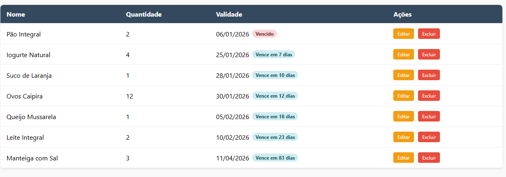
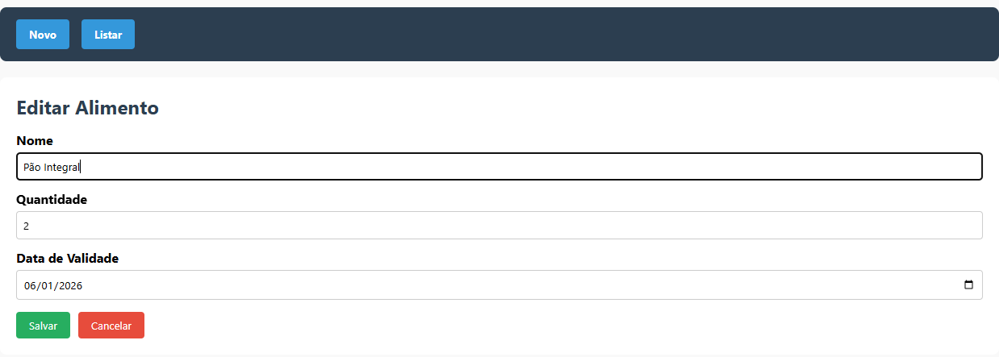

🧊 Fridge — Minha Geladeira (Spring Boot + H2 + Frontend JS)

Aplicação simples de gerenciamento de alimentos de uma geladeira, com CRUD completo, controle de validade, filtros e destaque visual para itens vencidos.
[](#)
[](#)
[](LICENSE)
[](https://github.com/harlemsilvas/fridge-springboot)
[](https://github.com/harlemsilvas/fridge-springboot/commits/main)
[](https://github.com/harlemsilvas/fridge-springboot/stargazers)

✅ Backend em Java + Spring Boot
✅ Banco em memória H2 (ideal para estudos)
✅ Frontend em HTML/CSS/JavaScript puro servido pelo próprio Spring (/static)
✅ Projeto 100% local (mesmo host/porta), sem dor com CORS

✨ Funcionalidades
📦 Backend (API REST)

- Listar alimentos
- Buscar alimento por ID
- Criar alimento
- Atualizar alimento
- Remover alimento
Endpoints
- GET /foods
- GET /foods/{id}
- POST /foods
- PUT /foods/{id}
- DELETE /foods/{id}

🖥️ Frontend (HTML/JS)
- Tela de listagem em tabela
- Formulário com modo Novo / Editar
- Voltar automaticamente para a lista após salvar
- Reset correto do formulário
- Validade formatada em dd/mm/aaaa
Badges de status:
- ✅ Vence em X dias
- ⚠️ Vence hoje
- ❌ Vencido
Linha inteira destacada para itens vencidos
Filtros:
- Todos
- Somente vencidos
- Vencem em 7 dias
Ordenação:
- Primeiro por validade (mais próximo vence primeiro)
- Empate por nome (A–Z)
---
🧱 Estrutura do Projeto (principal)
```pgsql
src/
 ├── main/
 │   ├── java/
 │   │   └── dev/java10x/Fridge/
 │   │       ├── controller/
 │   │       │   └── FoodController.java
 │   │       ├── model/
 │   │       │   └── Food.java
 │   │       ├── repository/
 │   │       │   └── FoodRepository.java
 │   │       ├── service/
 │   │       │   └── FoodService.java
 │   │       └── exception/
 │   │           └── ValidationExceptionHandler.java
 │   └── resources/
 │       ├── static/
 │       │   └── index.html
 │       ├── application.yaml
 │       └── data.sql

```
🚀 Como rodar localmente
✅ Requisitos
- Java 17+
- Maven (ou usar o wrapper ./mvnw)

▶️ Rodando o backend + frontend
No terminal, dentro do projeto:
```bash
./mvnw spring-boot:run
```
Depois acesse no navegador:

📌 Frontend:
👉 http://localhost:8080/index.html

📌 API REST:
👉 http://localhost:8080/foods
---
## 📷 Screenshots




🗃️ Banco H2 (Console)

O projeto usa banco em memória H2 para facilitar testes.

Abrir console:

👉 http://localhost:8080/h2-console

Use as configs abaixo:

JDBC URL: jdbc:h2:mem:testdb

User: sa

Password: (vazio)

🧪 Exemplo de JSON (POST/PUT)

Criar alimento
POST /foods
```json
{
  "name": "Leite Integral",
  "quantity": 2,
  "expirationDate": "2026-02-10"
}
```
✅ Seed automático com data.sql

Ao iniciar o projeto, alguns alimentos são inseridos automaticamente no H2 via:

📌 src/main/resources/data.sql

🔥 Melhorias futuras (ideias)
- Página de dashboard (itens vencidos / próximos 7 dias)
- Campo categoria (ex: laticínios, carnes, bebidas)
- Notificação de vencimento
- Persistência com PostgreSQL/MySQL
- Deploy com Docker

📌 Tecnologias utilizadas

- Java 17+
- Spring Boot
- Spring Web
- Spring Data JPA
- H2 Database
- Validation (Jakarta)
- HTML + CSS + JavaScript puro

## 🐳 Running with Docker

### Requirements
- Docker + Docker Compose

### Run
```bash
docker compose up --build
```
Open:
- UI: [http://localhost:8080/index.html](http://localhost:8080/foods)
- API: [http://localhost:8080/foods](http://localhost:8080/foods)
---
[](https://github.com/harlemsilvas/fridge-springboot/issues)
[](https://github.com/harlemsilvas/fridge-springboot/pulls)
---
## 🔗 Repositório
👉 https://github.com/harlemsilvas/fridge-springboot
---
## 👤 Autor
Harlem Silvas  
GitHub: https://github.com/harlemsilvas
---
📄 Licença

Projeto para fins de estudo / prática.

Sinta-se livre para clonar e evoluir.